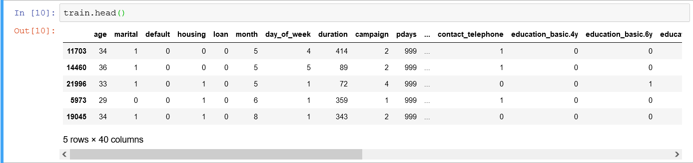

# Optimizing an ML Pipeline in Azure
## by Cristian Alberch as part of Udacity Nanodegree "Machine Learning Engineer with Azure"

## Overview
This project is part of the Udacity Azure ML Nanodegree.
In this project, we build and optimize an Azure ML pipeline using the Python SDK and a provided Scikit-learn model.
This model is then compared to an Azure AutoML run.

## Useful Resources
- [ScriptRunConfig Class](https://docs.microsoft.com/en-us/python/api/azureml-core/azureml.core.scriptrunconfig?view=azure-ml-py)
- [Configure and submit training runs](https://docs.microsoft.com/en-us/azure/machine-learning/how-to-set-up-training-targets)
- [HyperDriveConfig Class](https://docs.microsoft.com/en-us/python/api/azureml-train-core/azureml.train.hyperdrive.hyperdriveconfig?view=azure-ml-py)
- [How to tune hyperparamters](https://docs.microsoft.com/en-us/azure/machine-learning/how-to-tune-hyperparameters)


## 1. Summary
This ficticious dataset belongs to a bank and includes 20 different features from its customers (age, job, marital status, loans, etc.) This dataset is mapped to a binary target (yes/no) to determine the marketing campaign effectiveness.

The best model using hyperparameter tuning was a logistic regression model achieving an accuracy of 0.9146.
The best model using AutoML was a Voting Ensemble model achieving an accuracy of 0.9176.                                


## 2. Scikit-learn Pipeline

The Azure ML Pipeline steps:
1. Calls the conda Environment dependencies.
2. Calls the train.py script. 

In this script, the data is split into training and test datasets (0.8/0.2 split) and fed into a logistic regression algorithm from SKLearn.



3. Parameters for early termination policy are defined.
4. Parameters for hyperparemter turning are defined. 
5. The Hyperdrive configuration for AzureML is defined to maximize 'Accuracy'.

**Choosing Hyperparameter tuning**

Reference: https://scikit-learn.org/stable/modules/generated/sklearn.linear_model.LogisticRegression.html

*C: Inverse of regularization strength; must be a positive float. Like in support vector machines, smaller values specify stronger regularization.*

*max_iter: Maximum number of iterations taken for the solvers to converge.*

A wide range is selected but also limiting the random parameter sampling to 3 choices considering the running time.

Discrete hyperparameters:
```
ps = RandomParameterSampling(
    {
        '--C': choice(0.1,1.0,10),
        '--max_iter': choice(100,200,300)
    }
)
```

***Choosing Early Termination Policy**

Reference: https://docs.microsoft.com/en-us/azure/machine-learning/how-to-tune-hyperparameters

* *Early stopping of runs will be determined by a BanditPolicy, which stops a run whose primary metric falls outside the slack_factor*

* *Bandit policy is based on slack factor/slack amount and evaluation interval. Bandit ends runs when the primary metric isn't within the specified slack factor/slack amount of the most successful run.*

* *slack_factor or slack_amount: the slack allowed with respect to the best performing training run.*

The primary metric is accuracy. As all the models are seen to be performing with very similar accuracies, a small slack_factor of 0.1 was chosen so that models that significantly deviate can be terminated early.

The evaluation_interval is set to 1 (default) so that it is checked against every model.

The delay_evaluation is set to 5, so that the termination policy only starts to apply after the 5th model, as the differences in accuracy is expected to be more significant during the first model simulations.

```
policy = BanditPolicy(slack_factor = 0.1,
        evaluation_interval = 1,
        delay_evaluation = 5)
```


## AutoML

## 3. AutoML

**In 1-2 sentences, describe the model and hyperparameters generated by AutoML.**

The AutoML carries out multiple models comparison for a 'Classification' task with the aim to improve the selected primary metric of 'Accuracy'.


## 4. Pipeline comparison

As opposed to the Hyperparamter tuning pipeline, the AutoML pipeline does not call the train.py script.
The data is retrieved from a dataset url (https:// address), converted into Tabular format, and split into training and test datasets (0.8/0.2 split - same ratio as in the hyperparameter pipeline).

The training dataset is fed into classification algorithms (32 were evaluated).

The best model using AutoML was a Voting Ensemble model achieving an accuracy of 0.9176, as opposed to a Logistic Classifier with an accuracy of 0.9146 obtained using hyperparameter turning.

The difference in accuracies is very small. Considering the number of training samples, the number of training features, and the margins of error in the training data, both models can be considered equivalent. 

## Future work
The AutoML can be used during the model evaluation exploratory phase. Hyperparameter tuning could then be used to try to improve the accuracy of the best model in AutoML (Voting Ensemble method in this case).

In addition to accuracy, other performance features would need to be considered in order to select the model (eg. running time, and explainability).